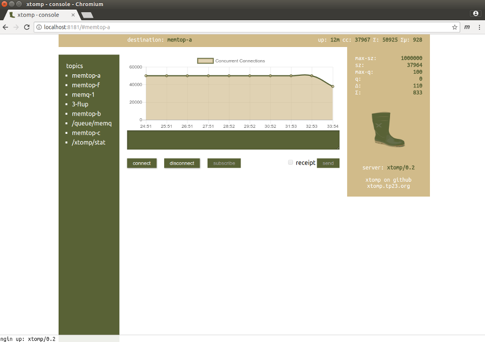

# xtomp-console

## Install

There are two options running form the package manager or running from source code.

Pacakge manager will create the required users and groups.

To run from source you need the `xtompc.xtomp` user manually.

## Setup xtomp server.

add the `/xtomp/stat` destination so that xtomp provides statistics on a STOMP destination.

	#
	# Magic topic, if this exists, statistics are published here
	#
	destination {
		name             /xtomp/stat;
		web_read_block   on;
		web_write_block   on;
	}

Ensure that xtomp is listening on `localhost:61613` for local usage statistics messages.

Ensure that xtomp is listening on `localhost:8080` if you want to be able to connect to topics and view and send messages. Depending on security config some topics may not be available.

Ensure web_sockets is on if you wish to monitor the topics via the console.

##  Configuration

`./lib/config.js` has a couple of configuration options including the port to listen on.  
xtomp-console is hardcoded to listen on 127.0.0.1, you can hack the code to change that or add nginx to expose console on the network.

## Starting the console

To start with systemd

	sudo systemctl start xtomp-console

Run from source with

	sudo bin/start

Open [http://localhost:8181](http://localhost:8181) in a browser.

